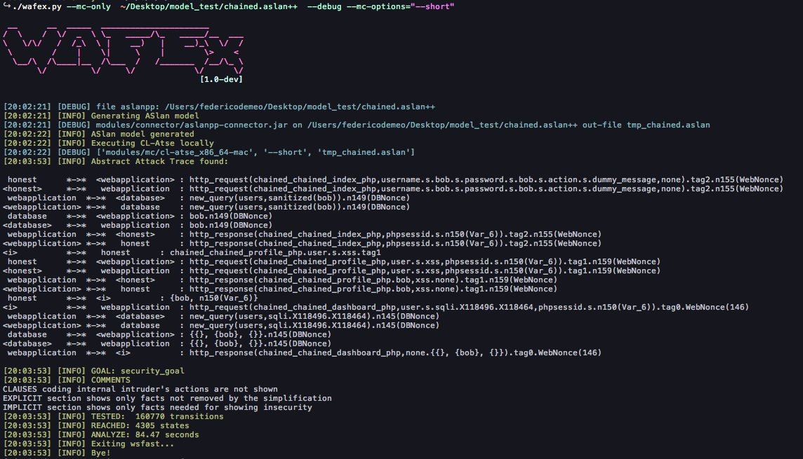

# WAFEx
Web Application Formal Exploiter (WAFEx) is a protype tool written in python to show that the canonical Dolev-Yao attacker model can be used to generate and exploit multi-stage attacks where multiple vulnerabilities are combined and exploited together. WAFEx takes in input and ASLan++ model of a web application along with a concretization file and seaches for attacks to the ASLan++ model.

## Requirements
* Python3
* Python requests
* Python pexpcet
* sqlmap
* Wfuzz
* Java 1.7 or above
* Cl-AtSe (included in the repository)
* ASLan connector (included in the repository)


## Installation
Clone the master repository, set execution privileges:

```
chmod +x wafex.py
```

Run WAFex:
```
wafex.py
``` 

## Usage

```
usage: wafex.py [-h] [--c concre_file] [--debug] [--mc-only] [--interactive]
                [--verbose] [--translator] [--proxy ip:port]
                [--mc-options MC_OPTIONS] [--mc-timeout T]
                model

positional arguments:
  model                 An ASLAn++ model

optional arguments:
  -h, --help            show this help message and exit
  --c concre_file       The concretization file, needed for executing Abstract
                        Attack Trace
  --debug               Print debug messages
  --mc-only             Run the model-checker only and exit
  --interactive         Ask input of every parameter
  --verbose             Increase the output verbosity

Translator:
  --translator          Specify a jar translator to use. Allowed values are
                        1.4.1, 1.4.9, 1.3. Default (1.4.1)

HTTP(S) options:
  --proxy ip:port       Use an HTTP proxy when executing requests

Cl-Atse options:
  --mc-options MC_OPTIONS
                        String representing the options to pass to Cl-Atse.
                        For more information on the available options check
                        Cl-Atse manual
  --mc-timeout T        If Cl-Atse runs more than T seconds, abort (default:
                        600)
```

## Output example


